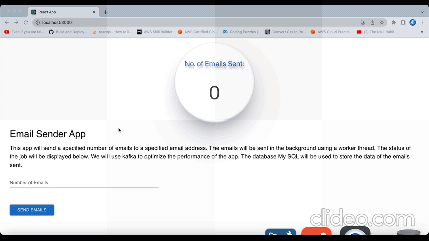

# EmailSender Using Kakfa And MySQL 🚀

This is the stable version of front end, kafka, mysql and all other services running together correctly

## Pre-Requisites ✅

- Make sure the Docker is installed
- Before starting the project docker must be runnning on your system.

## Getting Started 🚀

- To start the project you must be in the root of the directory EmailApp where docker-compose.yml is present and then enter the following command:

```bash
docker compose up -d
```

After runnning the above command, the project will be started as follows

1. Front End at : [http://localhost:3000/](http://localhost:3000/) 🌐
2. Producer at: [http://localhost:3001/](http://localhost:3001/) 🌐
3. Database MySQL will be running. 💾
4. Kafka will also start 🚀
5. Kafka ui will start at : [http://localhost:8080/](http://localhost:8080/) 🌐

> <i>You can see how it will be running from front end. If the setup is successfully started</i>
> 

- If you want to stop the docker then run the followig:

```bash
docker compose down
```

## Testing the BackEnd Seperately 🔍

After the project is running from docker as mentioned earlier you will see producer running at :
[http://localhost:3001/](http://localhost:3001/) 🌐. You can also test the producer as follows:
On PostMan add a new **POST** request at the URL: [http://localhost:3001/email/produceEmail](http://localhost:3001/email/produceEmail) 🌐 with the following JSON body

```json
{
  "to": "bialmohib7896@gmail.com",
  "numEmails": 3000,
  "subject": "Determination in programming",
  "body": "<p>This is a test email sent using the <strong>Nest.js Email Service.</strong></p>"
}
```

And send the request. If sent successfully you will see the following response:

```bash
{
    "message": "Congratulations 🎉! Emails sent successfully to the Kafka topic: medium.rocks",
    "status": 200
}
```

To verify if emails are being sent please navigate to the consumer terminal and there you will find that each and every email sent by producer is being consumed by consumer and then the status of it is also updated in the mysql database table in email table.

<video width="800" controls>
  <source src="./ReadmeMaterial/postmandemo.mp4" type="video/mp4">
  Your browser does not support HTML video.
</video>

## Conclusion 🎯

In Conclusion! This email app uses Kafka to make the process of bulk email sending smooth and easy. 🚀📧